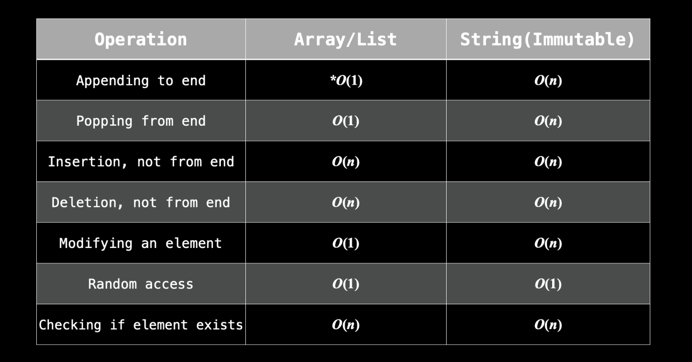

## Arrays-Strings

Python primarily uses "lists" instead of arrays which are extremely lenient. Initialization is as easy as `arr = []`

> Technically, an array can't be resized. A dynamic array, or list, can  be. In the context of algorithm problems, usually when people talk about arrays, they are referring to dynamic arrays. **In this entire course, we will be talking about dynamic arrays/lists, but we will just use the word "array".**

In Python Strings  are immutable**(Anki)**

> **Anki**Mutable: a type of data that can be changed. Immutable: A type of data  that cannot be changed. If you want to change something immutable, you  will need to recreate the entire thing.

**(Anki)**Why should we care about something being mutable or immutable? If you have a mutable array `arr = ["a", "b", "c"]` and an immutable string `s = "abc"`, but you want to instead represent `"abd"`, you can easily do `arr[2] = "d"`, but you cannot do `s[2] = "d"`. As such, if you wanted the string `s = "abd"`, you would need to create it entirely from scratch. With such a small  string, it's not a big deal. But sometimes you are dealing with strings  with 100,000 characters, so creating new versions just to modify one  character is very expensive (O(n)O(n), where nn is the size of the string).

